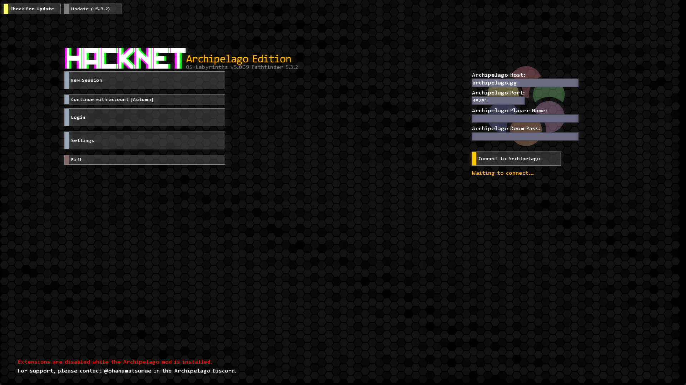

# Hacknet: Archipelago Mod
aka, **HacknetAP**

---

Hi, my name is Bit, and if you're reading this, I'm already dead.

The circumstances of my death were... unique, to say the least. In order to prevent just anyone uncovering this rat's nest, I've scattered the programs you need across multiple different universes. Some very similar to your own, but most not.

Work smart, work hard, and work in unison to find me and avenge my death. Doing this now is our last chance, I think.

---

## What is Hacknet: Archipelago?
Hacknet: Archipelago (referred to as **HacknetAP** from here on out) is a [Pathfinder](https://github.com/Arkhist/Hacknet-Pathfinder.git) mod for Hacknet that adds [Archipelago](https://archipelago.gg) support to the base campaign, along with Labyrinths.

To install the mod, download the ZIP file from the Releases section, and unzip it into the `BepInEx/plugins` directory of your Hacknet: Pathfinder installation.

## I don't see Hacknet on the site?
Hacknet is not currently officially supported by Archipelago at the moment, but that doesn't mean you can't play it! Hacknet is available [as an APWorld](https://diamondgrid.net/archipelago/files/hacknet/hacknet.apworld), requiring you to simply plop the .apworld file into the `lib/worlds` directory of your Archipelago installation.

To create a YAML profile for HacknetAP, please visit [this website](https://diamondgrid.net/archipelago/files/tools/hacknet/hacknet.html). Follow the instructions on said website in order to generate a player YAML for a Hacknet session in Archipelago.

---

## Development
Everything pertaining to the development of the Hacknet *mod* - this does not cover development for the APWorld.

### Required Packages

* [Archipelago C# Library](https://www.nuget.org/packages/Archipelago.MultiClient.Net/5.0.6)

### Additional Details

* HacknetAP has been tested with Archipelago 0.4.3, and may not work on earlier/later versions.
* My C# is still... rusty, to say the least. This isn't going to be your ideal C# codebase.
* This has only been tested with the [Steam version](https://store.steampowered.com/app/365450/Hacknet/) and may not work for other versions (GOG, itch, etc.)
    * If, for some ungodly reason, you still have the Origin/EA or Discord versions of Hacknet, this 100% WILL NOT WORK.

### Creating The Mod File

* Clone this repository
    * `git clone https://github.com/AutumnRivers/HacknetArchipelago --depth 1`
* Place the Archipelago C# Library DLL in the `/packages` folder.
* Set up Visual Studio (or your relevant IDE) to [build for x86](https://learn.microsoft.com/en-us/visualstudio/ide/how-to-configure-projects-to-target-platforms?view=vs-2022).
* Build the file. It should be in `bin/x86/Debug`.
* If you haven't already, [Install Hacknet: Pathfinder](https://github.com/Arkhist/Hacknet-Pathfinder)
* When copying the file over to Hacknet (`/BepInEx/plugins`), also be sure to copy over:
    * The Archipelago C# DLL
    * The `/assets` folder
* From here, you should be good to go.

### Debug Commands
The mod also comes with a few debug commands that should help you with testing:
* `checkitems` - Shows the received items the mod has tracked.
* `architest` - Sends a test packet to the Archipelago server and sends "Hello, Archipelago!" to the socket for all players.
* `fakeconnect` - Triggers the "Fake Connect" trap.

---

Safety in numbers.
